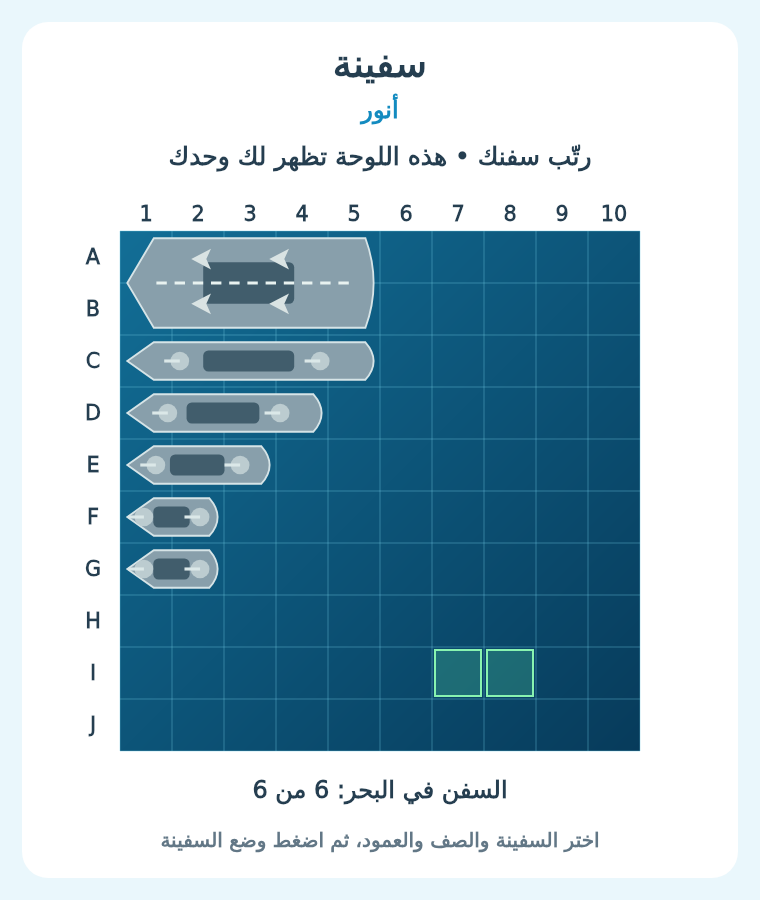
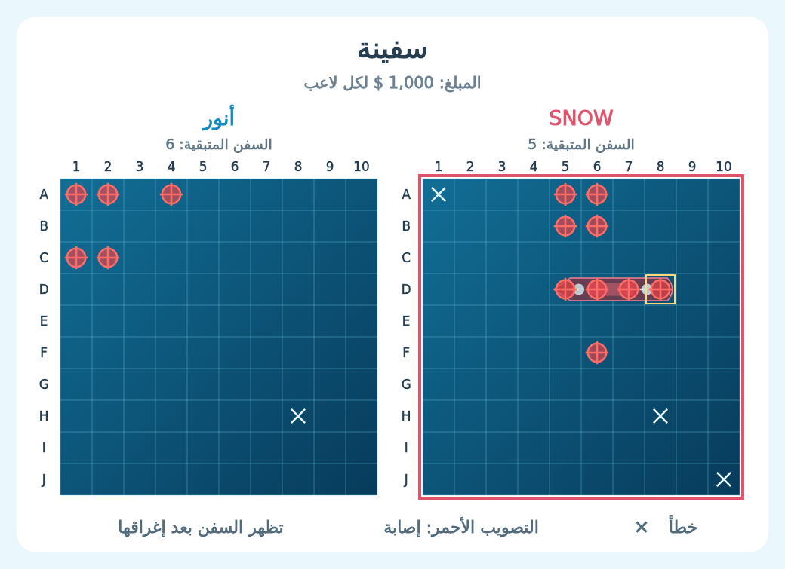
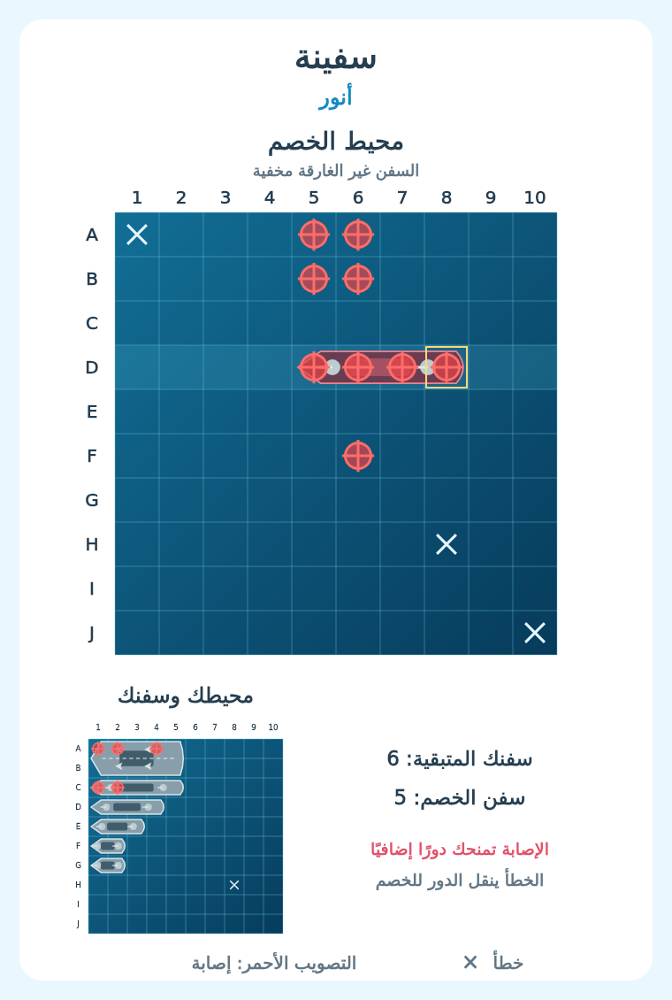

# سفينة — 2.5.49

## بدء التحدّي

اكتب `سفينة @العضو 1000` في شات البنك، مع منشن حقيقي. يعمل أيضًا `!سفينة` و`-سفينة` بنفس المعاملات، أو `/سفينة` بخياري العضو والمبلغ. الأرقام العربية والإنجليزية مدعومة. أُضيف زر سفينة إلى قائمة الألعاب وموعد إرسال التحدّي التالي إلى أمر وقت.

نفس أسلوب دوت ومربعات: دعوة في الشات بقبول ورفض، ألوان للطرفين، لوحة مرسومة تتحدث مع اللعب، وحجز مبلغ متساوٍ من الطرفين عند القبول. يبدأ صاحب الدعوة الهجوم باللون الأزرق وخصمه بالأحمر.

## الأسطول

لكل لاعب بحر مستقل من 10×10 وست سفن، بمجموع 26 خانة:

| السفينة | الحجم |
| --- | --- |
| حاملة طائرات | 2×5 |
| بارجة | 1×5 |
| مدمرة | 1×4 |
| غواصة | 1×3 |
| زورق ١ | 1×2 |
| زورق ٢ | 1×2 |

اعتمد التحديث السفن الست الظاهرة في الصور؛ الفوز يتطلب إغراق الست جميعًا. لا يكفي إغراق خمس سفن. يمكن أن تتجاور السفن، ولا يمكن أن تتداخل أو تتجاوز الحدود.

## ترتيب السفن

1. بعد قبول التحدّي اضغط **ترتيب سفني** في الرسالة العامة. تفتح رسالة خاصة داخل الشات لا يراها غيرك، ولا تحتاج إلى فتح الرسائل المباشرة.
2. اختر السفينة، ثم صف البداية A–J وعمود البداية 1–10. البداية هي الزاوية العليا اليسرى للمساحة التي تشغلها السفينة.
3. اضغط **تدوير** لتغيير الاتجاه في المعاينة، ثم **وضع السفينة** لتثبيت الموضع. يُمنع التداخل والخروج من البحر. يمكن إعادة اختيار سفينة موضوعة وتغيير مكانها قبل الجاهزية.
4. زر **عشوائي** يرتّب السفن الست كلها، وزر **مسح الترتيب** يمسح ترتيبك لتبدأ من جديد.
5. اضغط **جاهز** بعد وضع جميع السفن. لا يمكن تحريكها بعد تأكيد الجاهزية. تبدأ المعركة تلقائيًا عندما يجهز الطرفان.

هذه أدوات ترتيب بالأزرار والقوائم داخل Discord. المعاينة الخضراء تعني مساحة متاحة والحمراء تعني تداخلًا. إذا تجاوزت المعاينة حدود البحر يظهر تنبيه في وصف اللوحة.

## الهجوم

- عندما يأتي دورك اختر **صف الهجوم** من قائمة الرسالة العامة. تفتح لوحة خاصة بها عشرة أزرار لخانات ذلك الصف؛ مثال: A1 إلى A10.
- زر **لوحتي** يعرض محيط خصمك كبيرًا، ومحيطك وسفنك في الأسفل. يمكن الهجوم منها كذلك. زر **تحديث لوحتي** يحدّث الحالة بعد حركة خصمك، أو يمكنك فتحها مجددًا من الرسالة العامة.
- علامة × بيضاء للخطأ؛ يتنقل الدور إلى خصمك. مؤشر التصويب الأحمر للإصابة؛ تستمر في دورك مع مهلة جديدة.
- السفينة تظهر للخصم وفي اللوحة العامة عند إصابة جميع خاناتها وإغراقها فقط. سفنك غير الغارقة تظهر لك في لوحتك الخاصة.
- لا يمكن الهجوم على خانة سبق ضربها، أو اللعب مكان الخصم، أو استخدام لوحة قديمة لتنفيذ حركة إضافية.
- أول من يغرق السفن الست يفوز بمبلغ خصمه كاملًا، مع استرجاع مبلغه، بدون ضريبة.

## المهل وحفظ الرصيد

- قبول الدعوة: 30 ثانية. الرفض أو انتهاء الدعوة لا يخصمان رصيدًا.
- ترتيب الأسطول: 5 دقائق من القبول، للطرفين معًا. إذا جهز لاعب واحد فقط يفوز عند انتهاء المهلة. إذا لم يجهز أي لاعب، أو تعذر تأكيد عرض حالة اللعبة، تُلغى الجولة وتُعاد المبالغ.
- كل هجوم: 30 ثانية. انتهاء مهلة لاعب يعني خسارته، بشرط نجاح عرض حالة اللعب. تعذر عرضها يلغي الجولة ويرجع المبلغين.
- انتظار إرسال تحدٍّ جديد: 20 دقيقة على صاحب الدعوة من وقت القبول. استقبال التحديات متاح أثناء الانتظار، وانتظار سفينة مستقل عن الألعاب الأخرى.
- حالة الأسطول والضربات والدور والمهلة تُحفظ في MongoDB وتسترجع بعد إعادة التشغيل. المهلة تستمر أثناء الانقطاع. عمليات الخصم والصرف المحفوظة تستكمل مرة واحدة عند العودة.
- حذف رسالة التحدّي أو فقد صلاحيات الوصول إليها يلغي الجولة ويرجع المحجوز. تغيير شات البنك أو فقد عضوية أحد اللاعبين عند التفاعل يلغيها أيضًا. الريست لا يمس المبالغ المحجوزة في جولة قائمة.
- إيقاف البوت بواسطة `/البنك ايقاف` يمنع الأزرار والقوائم والاحتساب؛ بعد تشغيله تُلغى جولات سفينة التي سبقت الإيقاف ويُعاد المحجوز.

## التثبيت

ارفع ملفات المشروع المعدلة إلى مستودع البوت وأعد نشر خدمة Render بإعداداتها وقاعدة بياناتها الحالية. احتفظ بمجلد `assets` وملفي `package.json` و`package-lock.json`.

- أمر البناء الحالي: `npm ci --omit=dev`.
- أمر التشغيل: `npm start`.
- يسجل البوت `/سفينة` تلقائيًا ضمن أوامر السيرفر عند بدء التشغيل.
- يحتاج البوت صلاحيات عرض الشات وإرسال الرسائل والإيمبدات والملفات. لا توجد متغيرات بيئة أو مكتبات إضافية لهذا التحديث.

## التحقق

نجحت اختبارات الألعاب الـ220، ومنها 17 اختبارًا لسفينة تشمل السيناريوهات المركبة. راجعت صور اللوحة العامة والخاصة وترتيب الأسطول. اختبار الخصوصية يقارن الصور نفسها للتأكد من عدم تسريب مواقع السفن غير الغارقة.

الفحص الكامل: 995 ناجحة من 1004. حالات الفشل التسع موجودة بالاسم والسبب في الأصل: سبع مرتبطة باختبارات النهب القديمة، واثنتان بسبب قيد تشغيل العمليات الفرعية في بيئة الفحص. لم يضف التحديث حالات فشل. السجلات والتفاصيل في `VERIFICATION.md` و`docs/review-logs/v2.5.49/`.

الاختبارات محلية بمحاكاة Discord وMongoDB؛ لم يُنفّذ نشر أو اختبار داخل سيرفر فعلي. لإعادة إنشاء الصور شغّل `node scripts/ship-preview.js`.
